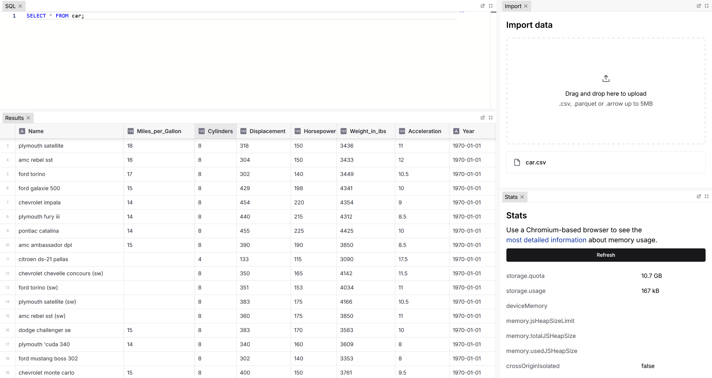

# DataBox

A data toolbox to run DuckDB queries in your browser.

## Features
- Load CSV, Parquet, Arrow files
- Edit SQL in Monaco editor
- View results in highly scalable `glide-data-grid`
- Use latest version of DuckDB (1.1.2)
- View statistics about memory/OPFS filesystem usage

## Contributing
Check out our [roadmap](ROADMAP.md). PRs are welcome!

## Key Dependencies
Thank you to these great libraries!

- [DuckDB WASM](https://github.com/duckdb/duckdb-wasm)
- [duckdb-wasm-kit](https://github.com/holdenmatt/duckdb-wasm-kit)
- [Glide Data Grid](https://grid.glideapps.com/)
- [@monaco-editor/react](https://github.com/suren-atoyan/monaco-react)
- [Chakra UI v3](https://chakra-ui.com/)
- [Vite](https://vitejs.dev/)
- [create-vite](https://github.com/vitejs/vite/tree/main/packages/create-vite)
- [SWC](https://swc.rs/)

## License

Apache-2.0